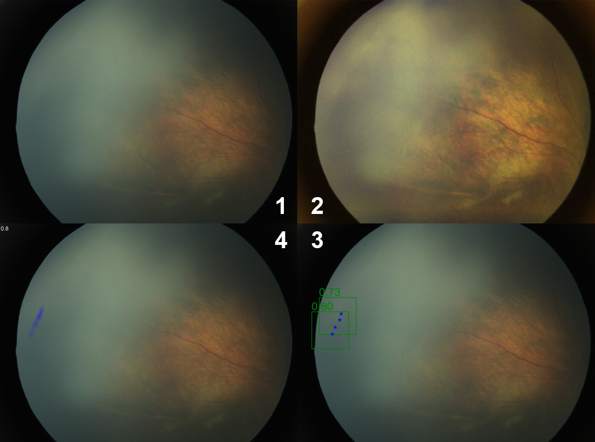
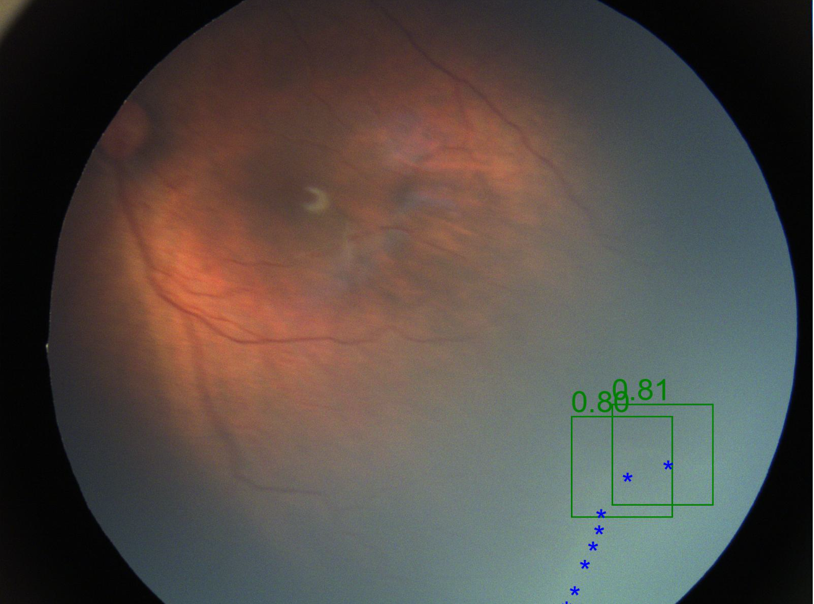
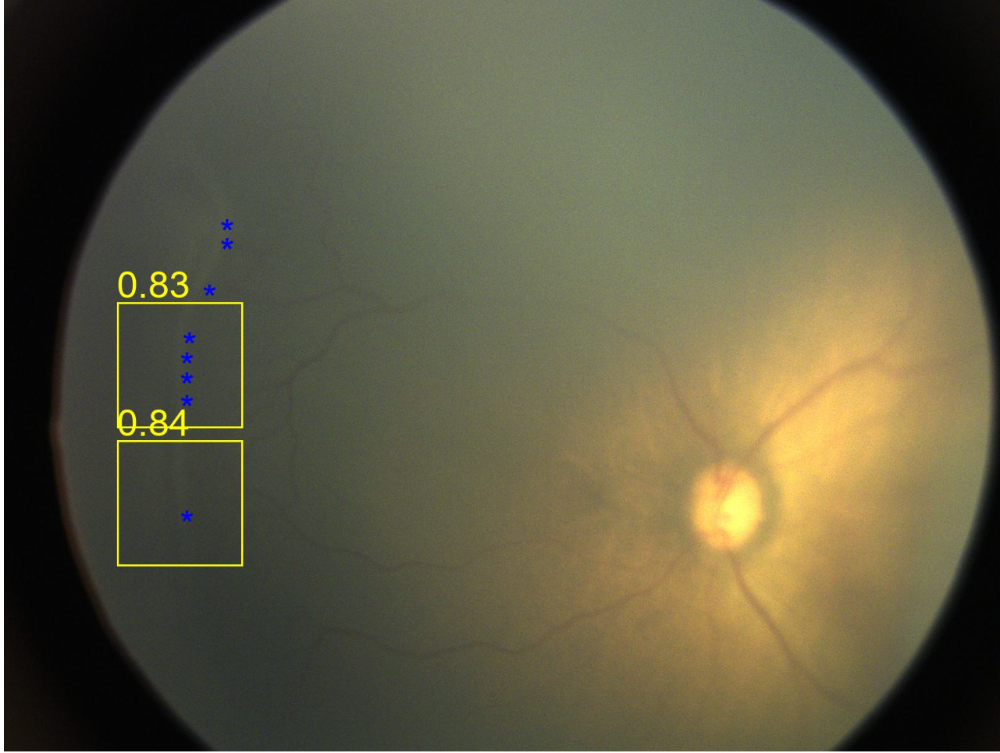
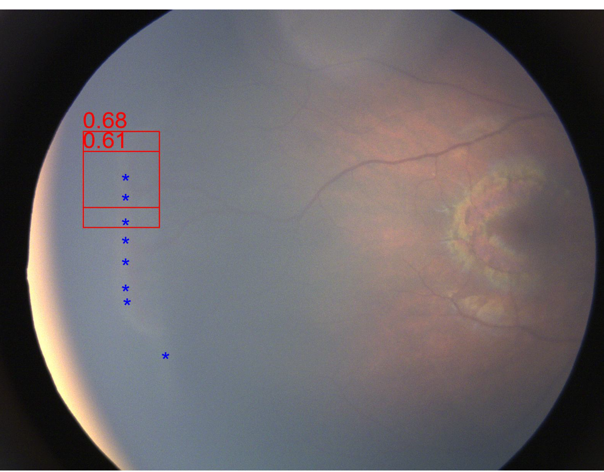
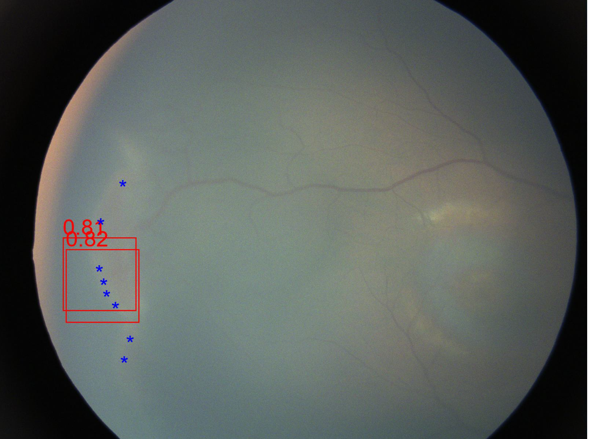

# ROP分期模拟软件使用守则
本实验共涉100张新生儿眼底标注，其中前50张将在没有辅助的情况下独立标注。对于实验组：后50张将在模型辅助下进行标注；对于对照组：后50张将仍旧在没有辅助下标注。本次实验设计ROP正常,1,2,3期。
# 模型辅助说明

辅助标注共分为4个部分。

1. 表示原始图片
2. 采用图像增强技术，理论上具有让ROP病灶更为明显的效果。
3. 分期建议，该图像中会采用"*"标注采样点，这个采样点是通过模型自动识别病灶得到。我们的模型会通过不同颜色的框代表相关的判断意见，并且会展示模型认为最严重的分期对应的两个框。颜色分别对应（根据红绿灯记忆，颜色约偏向于暖色，越严重）。框旁边的数字，代表置信度。
   1. 绿色：1期
   2. 黄色：2期
   3. 红色：3期
4. 病灶分割图像，表示模型认为病灶存在的地方，左上角的数字表示置信度

注意的是，模型在病灶分割的任务上，表现良好，但偶尔会将光晕误认为脊，或极度明显的病灶误认为光晕。总体准确率在90%以上。但由于分期任务具有一定主观性，分期建议不一定准确，需要结合一定自我判别，模型在该任务上准确率在70%左右。
# 分期标准说明

分期1：再有血管区和无血管区出现一条清晰的白色或灰色分界线。

分期2：分界线隆起变成脊。

分期3:在脊的基础上出现新生血管增生，这些新生血管可能伴随出血，使得整体的脊的色调变红。

  

分期3：脊向视网膜内侧生长。这意味着脊不仅在视网膜表面形成隆起，而且开始向视网膜内部生长

对于分期1，2。临床在确定具体分期时具有一定主观性，在实际标注中，可以通过对于病灶的明显程度进行判断。